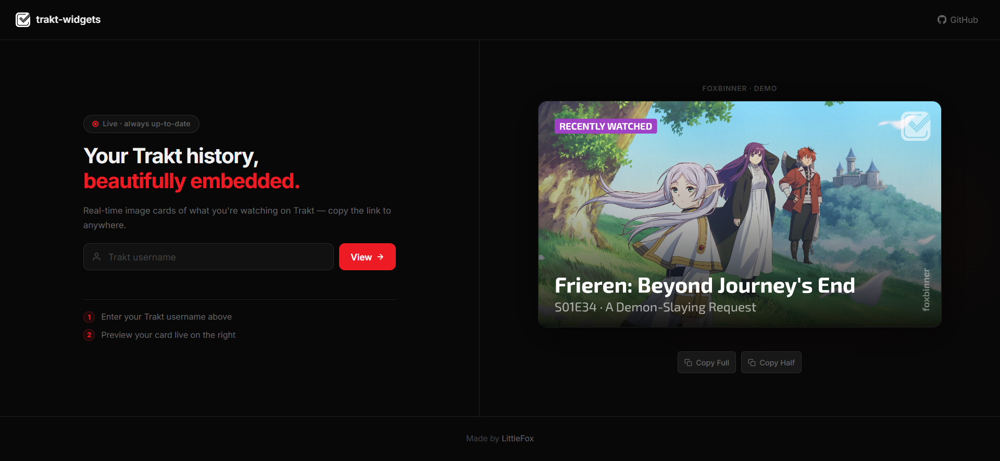

<div align="center">

# 📺 trakt-widgets

**Dynamically generated cards showing what you last watched on [Trakt.tv](https://trakt.tv)**  
Embed them in any README, website, or profile — as a PNG or live viewer.

[](https://traktrack.vercel.app)
[](LICENSE)



</div>

---

## ✨ Usage

> ⚠️ Your Trakt profile must be set to **public**.

Drop this anywhere — GitHub README, personal site, anywhere you can render an image:

```html
<!-- Last watched -->

```

Visit the URL **without** `.png` to get an auto-refreshing viewer page:

```
https://traktrack.vercel.app/{username}/watched
```

---

## 🚀 Self-hosting

**Prerequisites:** Node.js 22+, a [Trakt API](https://trakt.tv/oauth/applications) client ID, and optionally a [TMDB API key](https://www.themoviedb.org/settings/api) for HD backdrops.

```bash
git clone https://github.com/foxbinner/trakt-widgets
cd trakt-widgets
cp .env.sample .env   # fill in your keys
yarn install
yarn dev              # or: yarn start
```

| Variable          | Required | Description                |
| :---------------- | :------: | :------------------------- |
| `TRAKT_CLIENT_ID` |    ✅    | Trakt API client ID        |
| `TMDB`            |    ⬜    | TMDB key for HD backdrops  |
| `PORT`            |    ⬜    | HTTP port (default `3000`) |

To deploy on Vercel, just run `vercel deploy` — `vercel.json` is already configured.

---

## 🛠 Stack

[Express](https://expressjs.com) · [@napi-rs/canvas](https://github.com/Brooooooklyn/canvas) · [trakt.tv](https://www.npmjs.com/package/trakt.tv) · TMDB · TVmaze · Metahub · [Vercel](https://vercel.com)

---

## License

MIT © [foxbinner](https://github.com/foxbinner)
